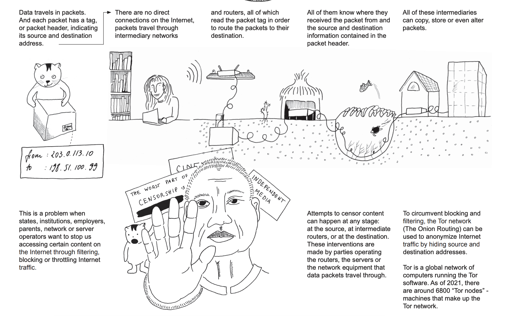
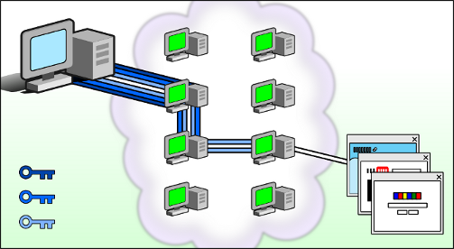
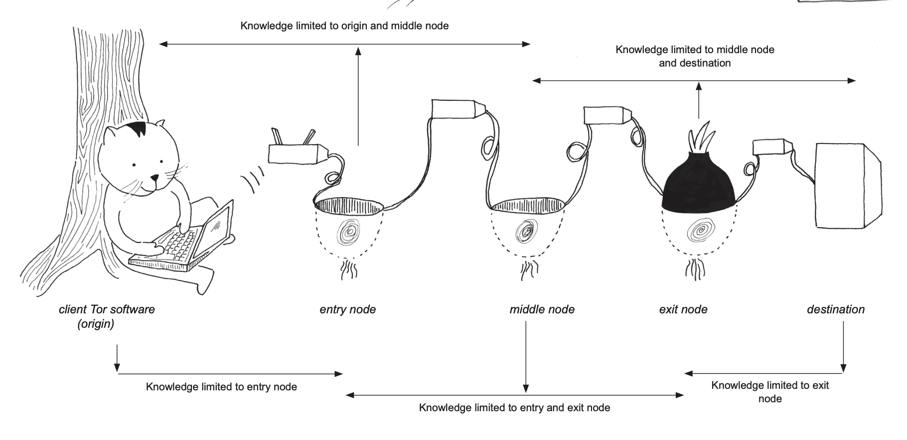
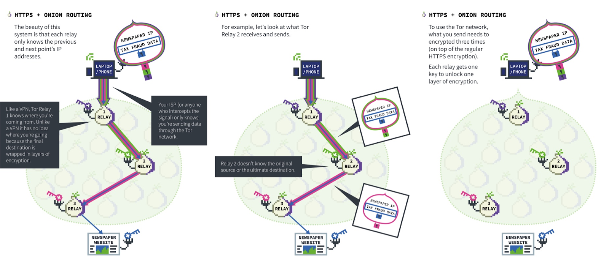
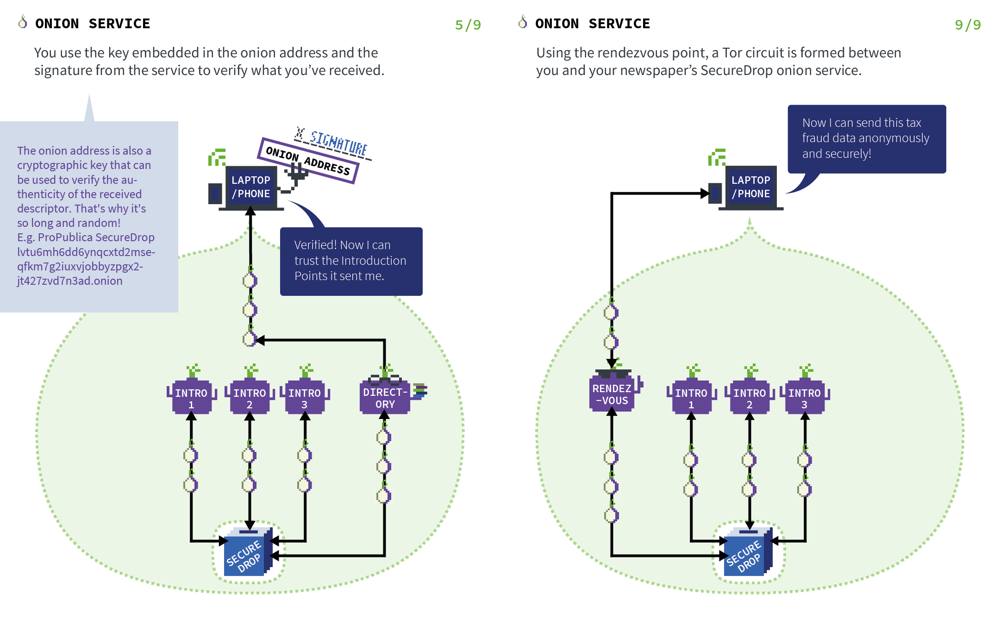

<!-- _class: default -->

# Let's peel an onion! 🧅
## A short introduction to Tor, from one beginner to another
### Lizz Thabet (she/they)
- [lizz.website](https://lizz.website)
- [github/lizzthabet](https://github.com/lizzthabet)

 
 
 
 
 
 
 
 

The slides: [TODO]
The demo code: https://github.com/lizzthabet/itp-camp-demo

---
<!-- header: 🧅 An introduction to Tor -->
<!-- _footer: TODO: If I get time, there will be onion jokes! -->

# Demo checklist

We're going to make our version of the "share one thing!" show with onion sites, using our own computers as web servers. You'll need:

- A browser that can access the Tor network, like [Tor Browser](https://www.torproject.org/download/) (recommended) or [Brave Browser](https://brave.com/)

- A copy of the [demo repository](https://github.com/lizzthabet/itp-onion-demo)

There will be two demo options: one more beginner and one more intermediate. If you're comfortable running terminal commands and navigating the command line, try the intermediate demo.

*For the beginner demo, you'll need:*
- [OnionShare](https://onionshare.org/) ([onion link](http://lldan5gahapx5k7iafb3s4ikijc4ni7gx5iywdflkba5y2ezyg6sjgyd.onion/#download))

*For the intermediate demo, you'll need:*
- The `tor` binary that will let you run an onion service locally. See [installation instructions](https://community.torproject.org/onion-services/setup/install/) ([onion link](http://xmrhfasfg5suueegrnc4gsgyi2tyclcy5oz7f5drnrodmdtob6t2ioyd.onion/onion-services/setup/install/index.html)) for each OS.
- A way to run a web server locally, like python or nginx

---

# What we'll do today

Tor is a free and open-source software for (more) anonymous communication.

## Goals
- Pique your curiosity about networking and the internet
- Demystify how Tor works and make it less scary... and even exciting!
- Pitch onion sites (and decentralized / p2p options) as a way to share your work

<!-- Speaker notes:
  ### What this session is not...
  - a guide to privacy and security best practices (with and without Tor)
  - historical overview of Tor (and its U.S. military funding)
  - ethical debates about free speech and Tor

  ...though there are many interesting and important spaces where these conversations are happening.
-->

## Outline

- Demo checklist (✅)
- Define our goals (✅)
- What is Tor exactly?
- Brief overview of the Internet (as we know it) works
- The Tor network
- The magic of onion sites
- Share One Thing! onion site demo
- Further resources

## Why am I leading this session?
[TODO]: Decide to cut this section based on time

<!-- 
  I learned about Tor because I was building a browser-based tool (aka a website) and I wanted to distribute it through technology that was structurally more relational than having a Hosted Website.

  What do I take for granted in my understanding of the internet, the "modern web, "and networks? What power dynamics are structurally embedded in the internet as I know it? How might the technology of networks be more relational? How might I have more agency as a user of networks?

  We're all experts! Feel free to chime in. If you ask me a question I can't answer, I'll look it up later and post the answer.
  Much of this text is borrowed and adapted from The Tor Project and I'll include links to more detailed information.
-->

---
# What is Tor?

The term `Tor` can be used to reference several different things. Let's break that down.

## 🌐 The onion network (The Tor circuit)
A network of virtual tunnels that allow you to improve your privacy and security on the internet. I'll use it to refer to the virtual + physical infrastructure of servers and how a client's request is routed to its destination.

## 🔗 Onion sites
A website that's only accessible over the Tor network.

## 🖥 The Tor browser
A version of Firefox that uses the Tor network to access the internet (clearnet) and onion sites. It makes other privacy improvements, like preventing websites "fingerprinting" your device. By default, it doesn't keep any browsing history and cookies are only valid for a single session.

## 👥 The Tor Project
The 501(c)(3) nonprofit organization that develops free and open source Tor software.

<!-- Both the Tor network and onion sites are run through core `tor` or little-t Tor. -->
<!-- 
  Their stated mission is:
  > To advance human rights and freedoms by creating and deploying free and open source anonymity and privacy technologies, supporting their unrestricted availability and use, and furthering their scientific and popular understanding.
-->
---

<!-- TODO: There are many reasons why you might use Tor or technology like it -->
[TODO]: Consider moving this slide to later or combining it with later slide

# Why would you use Tor?

There are many reasons why someone might use Tor, including:
- To obscure your information from third-party data collection and tracking
- To access content where it might be censored
- To share content privately, securely, and anonymously
- To use more decentralized networks, where there isn't a central authority that determines what content is acceptable or not, and where the infrastructure is shared, rather than controlled by for-profit entity

... and other reasons!

There are also many caveats to the benefits of using Tor, which we'll talk about if we have time.

---

# Overview of the Clearnet

We're going to borrow from [this wonderful guide](https://catnip.article19.org/data/ARTICLE19-Catnip-Tor-Network-2021-web.pdf) from 🌈 Catnip Explains 🌈.

<!-- Some extra notes if I want them:
  Basic model: there is a client, which requests content, and a server, which provides the requested content.
  The client and server communicate in an agreed-upon language, called a protocol. In this case the protocal is HTTP/HTTPS, which is built on top of a protocol called TCP.
  Every device on a network has an IP address, which is like a unique mailing address.
  When a client makes a request to itp.nyu.edu/, it needs to know what server to request that data from. Servers are available at IP addresses (mailing address), and it will go to what's called a DNS server to see what IP address itp.nyu.edu corresponds to.
  The server responds with content.
  With HTTPS, the data that the client sends with its request to the server is encrypted, so only the client and the server can read it.

  In this model... (talk about the features that Tor is trying to solve)

  Internet communication is based on a store-and-forward model that can be understood in analogy to postal mail: Data is transmitted in blocks called IP datagrams or packets. Every packet includes a source IP address (of the sender) and a destination IP address (of the receiver), just as ordinary letters contain postal addresses of sender and receiver. The way from sender to receiver involves multiple hops of routers, where each router inspects the destination IP address and forwards the packet closer to its destination. Thus, every router between sender and receiver learns that the sender is communicating with the receiver. In particular, your local ISP is in the position to build a complete profile of your Internet usage. In addition, every server in the Internet that can see any of the packets can profile your behavior.

  Excerpted from here:  http://rzuwtpc4wb3xdzrj3yeajsvm3fkq4vbeubm2tdxaqruzzzgs5dwemlad.onion/index.html#protections
-->
---
# So what does Tor do differently?

When you use the Tor network, your internet service provider (ISP) won't be able to track the names and address of the websites you visit, instead they'll only see you're connecting to the Tor network. And the websites you visit will see a connection coming from the Tor network instead of your real IP address.

[TODO] Figure out which description to go with.

The primary goal of Tor is to improve your privacy by sending your traffic through a series of proxies. It aims to solve three privacy concerns:

- First, Tor prevents websites and other services from learning your location, which they can use to build databases about your habits and interests.
- Second, Tor prevents people watching your traffic locally (such as your ISP or someone with access to your home wifi or router) from learning what information you're fetching and where you're fetching it from. It also stops them from deciding what you're allowed to learn and publish.
- Third, Tor routes your connection through more than one Tor relay so no single relay can learn what you're up to. Because these relays are run by different individuals or organizations, distributing trust provides more security than the old one hop proxy approach.

---

# So how does Tor work?

<!-- From Catnip guide:
  Any computer can run the Tor software and become a node. Think of Tor nodes like data checkpoints which take in, treat, and ship out packets traveling over the Tor network. A Tor circuit Using Tor, data packets are sent over the Internet’s infrastructure like any other packet. But packets traveling through the Tor network are routed randomly through three nodes (also called relays or hops) before reaching their final destination. This route, called Tor circuit, is changed every ten minutes to make it harder to observe for potential eavesdroppers. To route the packets down a random path, they are packed like an onion: each is wrapped into three encrypted layers containing a dedicated packet tag. But only a partial route is encoded on these tags, so that none of the relays know the entire path a packet takes. At each relay a single layer is peeled off and the packet is then sent to the next relay written on the tag of the underlying layer. This unwrapping and preparing to relay the packets is managed by the Tor software of the node. All that is visible from the outside is that obscure cargo is sent from place to place. Because of this, the Tor network is often pejoratively called the “dark net”. When we say that Tor packet layers are encrypted, it means that only the relay with the correct private encryption key is able to unwrap the corresponding layer.

  There are a bunch of caveats that are important to know about Tor!
-->
---

# So how does Tor work?

<!-- From The Tor Project:
  Tor works by sending your traffic through three random servers (which are called `relays`) in the Tor network. The first relay in the circuit is called a guard relay, and the last relay (called the exit relay) then sends traffic out onto the public internet. 

  There are three layers of encryption, one per node, so each relay only knows where the next location that it's sending the request. (Like a relay race!) Relays are run by volunteers throughout the world (so there's distributed trust) and they have IP addresses that are listed publically.

  The aim of Tor is to improve your privacy by sending your traffic through a series of proxies. Your communication is encrypted in multiple layers and routed via multiple hops through the Tor network to the final receiver. More details on this process can be found in this visualization. Note that all your local ISP can observe now is that you are communicating with Tor nodes. Similarly, servers in the Internet just see that they are being contacted by Tor nodes.

  More info about how nodes in the Tor network work: https://community.torproject.org/relay/types-of-relays/
-->

---
# So... how does an onion site work?

[TODO]: Flush out this slide more!

When you create an onion site, you get a `hostname`, a public key, and a private key. An onion service's IP address is protected.

The technical details of onion sites are so cool!

<!-- Thorough overview: http://xmrhfasfg5suueegrnc4gsgyi2tyclcy5oz7f5drnrodmdtob6t2ioyd.onion/onion-services/overview/index.html -->

<!-- 
  Previous slide: A website that's only accessible over the Tor network. The communication between a client and a server never leave the Tor network, so both the client and server can remain anonymous. The technology and content of onion sites are decentralized, so there isn't a central authority that determines what content is accessible and what isn't.

  Onion sites are also great for network health and sustainability, bc they don't add to the traffic on exit nodes, where there can be bottlenecks. When a user visits a particular onion, they know that the content they are seeing can only come from that particular onion. (No man-in-the-middle DNS attacks are possible.)

  Onion mirrors (NYTimes, Markup, Facebook, Twitter) also make sure that sites are accessible where they might be censored.
 -->

[Detailed breakdown](https://torproject.org/onion-services/overview/index.html) ([onion link](http://xmrhfasfg5suueegrnc4gsgyi2tyclcy5oz7f5drnrodmdtob6t2ioyd.onion/onion-services/overview/index.html))

---

---

# ✨🧅🌐 Demo 🔗👥🎨
 
 

## Let's head over to Github for the instructions! https://github.com/lizzthabet/itp-onion-demo

---
# Resources

## More on onion sites
- [How to make any site an onion site](https://github.com/alecmuffett/eotk)
- https://community.torproject.org/onion-services/: Great overview of onion sites
- https://riseup.net/en/security/network-security/tor/onionservices-best-practices
- https://github.com/s-rah/onionscan

## Tech education
 - Tech Learning Collective
 
- [Metro's Decentralized Web series](https://metro.org/decentralizedweb)

  - p2p stuffs:
    - Beaker Browser and Hypercore protocol
    - Dat protocol

## Further reading on Tor
- http://eweiibe6tdjsdprb4px6rqrzzcsi22m4koia44kc5pcjr7nec2rlxyad.onion/tpo/onion-services/onionprobe: Onionprobe

### Tor source:
- http://eweiibe6tdjsdprb4px6rqrzzcsi22m4koia44kc5pcjr7nec2rlxyad.onion/tpo/core/tor: Tor on Gitlab
- http://eweiibe6tdjsdprb4px6rqrzzcsi22m4koia44kc5pcjr7nec2rlxyad.onion/tpo/applications/tor-browser: Tor Browser on Gitlab

---

# Terms that may be helpful

**Client-server model**: In the client-server architecture, when the client computer sends a request for data to the server through a network, the server accepts the requested process and delivers the requested data packets to the client. 

**Decentralized network**: A decentralized network is not dependent on a single set of servers run by one company or entity. Federated and peer-to-peer networks are different approaches to designing networks that structurally empower users.

**Peer-to-peer (p2p) network**: In a p2p netwrok, each user's computer functions as both a client and a server, both requesting data and responding to requests. Each computer acts as equals or "peers," enabling people to communicate directly with each other.

**Federated network**: In a federated network, computers still function in a "client-server" model, where your computer is requesting data stored on someone else's server. The difference is that virtually anyone can run a server that connects and operates with other servers in the network. In general, there may be more trust between you and the servers that you're interacting with than between you and a for-profit corporation.

---
# I've heard of *x*. Is it like Tor?

**VPN (Virtual Private Network)**: a tool that creates a secure "tunnel" between a device and a VPN provider that conceals a device's IP address and encrypts traffic between the device and the VPN so that it can't be observed or intercepted on a local network. (The Tor Project has a [long guide](http://eweiibe6tdjsdprb4px6rqrzzcsi22m4koia44kc5pcjr7nec2rlxyad.onion/legacy/trac/-/wikis/doc/TorPlusVPN) to using a VPN with Tor.)

**BitTorrent**: a file-sharing protocol that makes it easier and faster to share very large files over a network. It's decentralized and peer-to-peer. (Note: The Tor Project has a lengthy blog post on torrenting files through Tor and how many torrent applications expose identifying user data.)

Anything else?